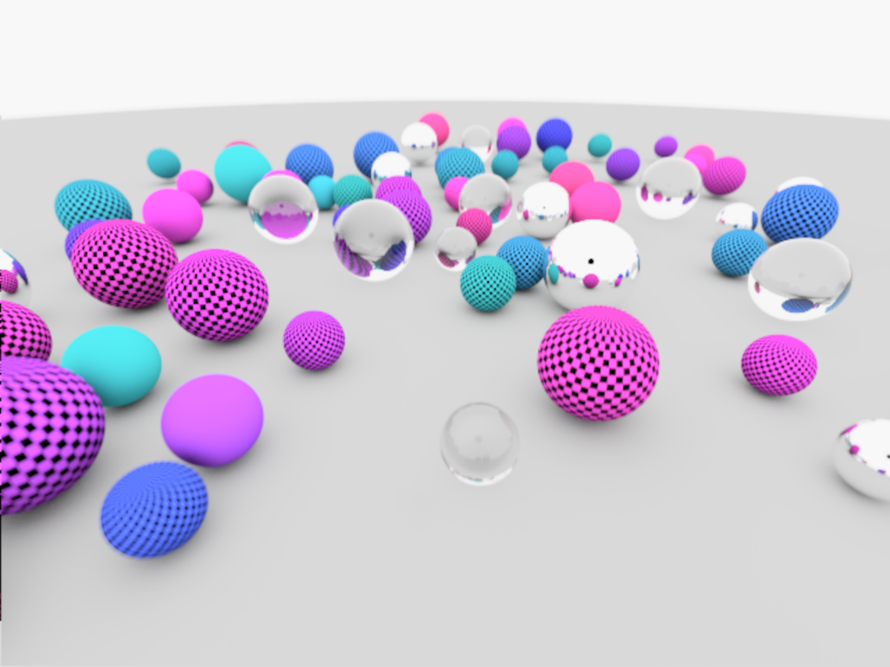
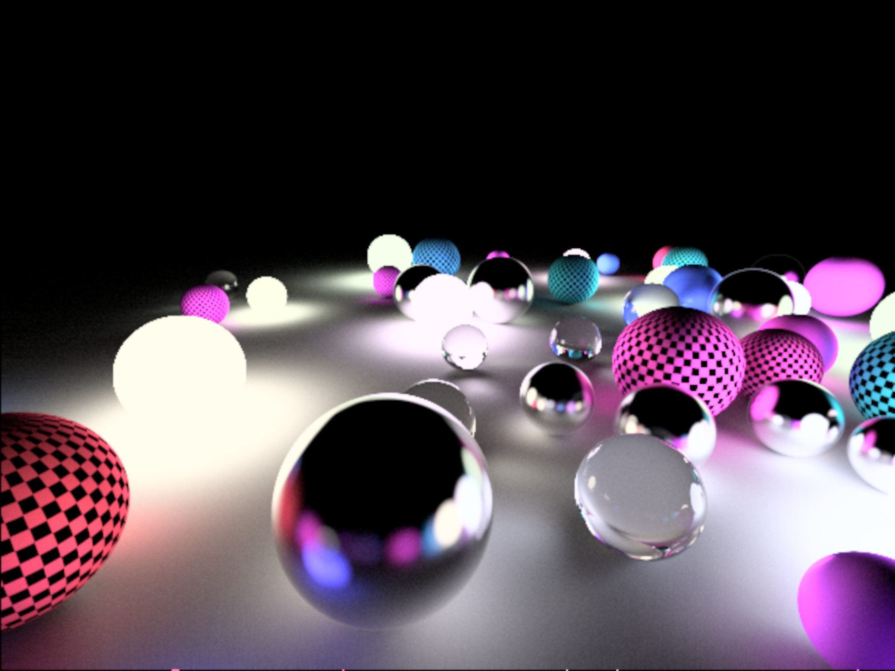

# Ray Tracer

Created by loosely following [Ray Tracing In One Weekend](https://raytracing.github.io/books/RayTracingInOneWeekend.html), implementation is completely different - GPU based.

Images usually converge into something sensibly looking within few seconds. Depending on the amount of light in the scene you have more or less noisy images, so you may have to wait longer to remove all the noise. For example the second image is something you get after <5 seconds. The third one though takes longer time to remove all the noise (~1-2 minutes).

## Controls

- F1 - show/hide UI
- F2 - randomly place spheres

# Build Instructions

**Requirements:**
* Visual Studio (preferably 2019 or 2017)
  
**Steps**
1. Clone [Builder repo](https://github.com/janivanecky/builder)
2. Make sure that path in `build.bat` inside Builder repo points to existing `vcvarsall.bat` (depends on your VS installation version)
3. Run `build.bat`
4. Optionally run `setup.bat` to setup PATH - you'll be able to run builder just by using `build` command
5. Clone [cpplib repo](https://github.com/janivanecky/cpplib)
6. Clone this repo
7. Run `build run ./ray_tracer.build` - if you didn't setup PATH in step 4, you'll have to use `YOUR_BUILDER_REPO_PATH/bin/build.exe` instead

If there are any problems you encounter while building the project, let me know.